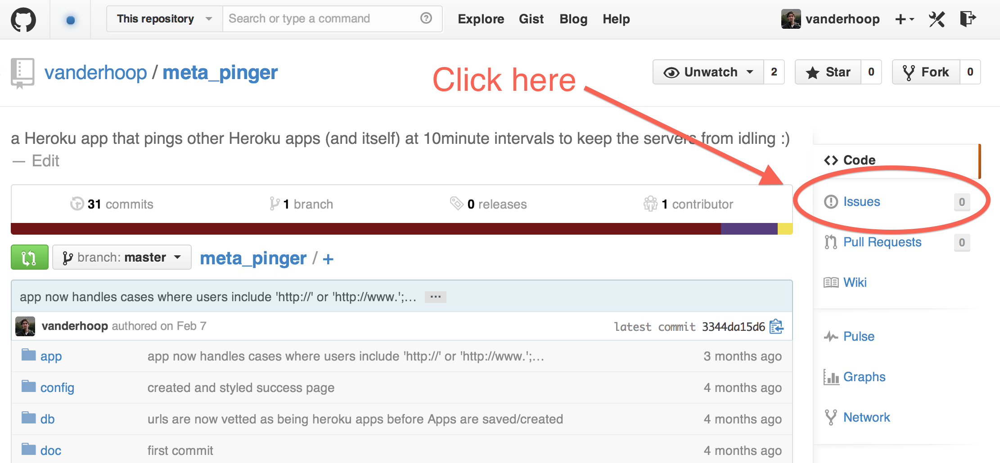

## Instructor Assistance for Project 3 & 4 Using GitHub Issues

In project 3 and 4, you will be submitting requests for instructor assistance on your project via **GitHub Issues**.

This document is a walkthrough on how to submit a GitHub Issue...

### Process

To obtain assistance, you must:

1. Add the instructors as **[collaborators](https://help.github.com/articles/adding-collaborators-to-a-personal-repository/)** on the project's GitHub repo.
1. Appropriately document each issue as follows...

### Documenting Issues as Time of Submission

As bad-ass as your instructors are, they cannot read minds.

In addition, at this stage of your journey to become a Web Developer, it's important that you've done what you can to solve any issues with your project within the team or on your own.

With this is mind, each issue needs to have the following **three sections**:  

1. **User Story:** What User Story (or feature) is the issue for?
2. **Issue:** What is the specific error or issue? The more detail the better.  Inclusion of screenshot(s) are **very helpful**.  How can we  reproduce the error?
3. **Attempted Resolution:** How have you attempted to fix your error or solve the issue?  What google searches have your performed? What StackOverflow postings have you read?

### Creating Issues

#### Step 1 - Click 'Issues' Within Your Project Repo

___

#### Step 2 - Click 'Create a new issue'

___

#### Step 3 - Describe the Issue

- Format your issue using Markdown.
- Always begin by typing in the headings for the three sections above:
	- **User Story**
	- **Issue**
	- **Attempted Resolution**
- Include enough information that it's possible to *reproduce the error*.

___

#### Step 4 - Assign Instructors to the Issue

Click the button to assign instructors to the issue.  This will notify instructors that assistance is necessary.

___

#### Step 5 - Submit the Issue

Click the **Submit new issue** button to submit. 

### Obtaining Assistance

Instructors may ask for further details via GitHub Issues.

Instructors may choose to help resolve the issue via GitHub Issues or in person.

