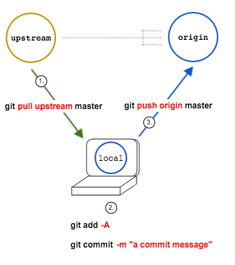

# Beginner Git & GitHub Workflow



**Our beginning workflow for the class looks like this:**

```
$ git pull upstream master

(… edit, create and delete some files)

$ git add -A
$ git commit -m "some commit message"
$ git push origin master
```

For more information, see **[the lesson notes from class][notes]**.

<!-- LINKS -->

[notes]: ../../work/w01/d02/instructor/git_workflow.md
