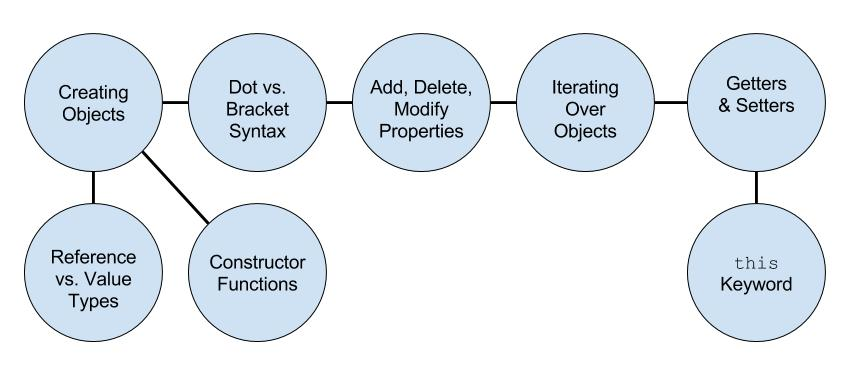
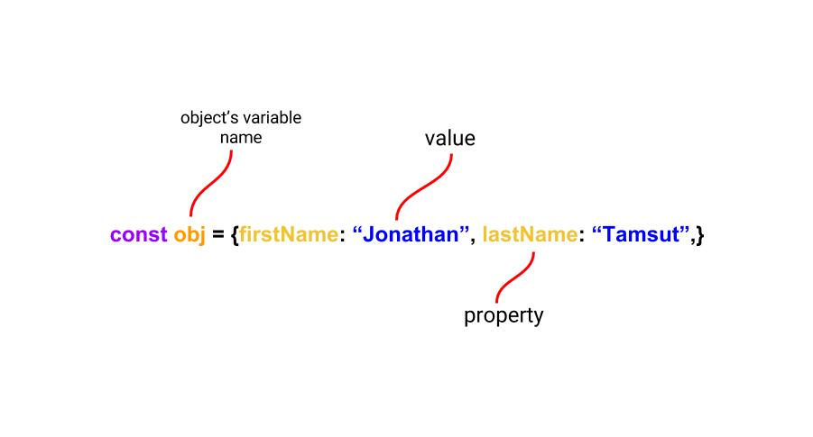
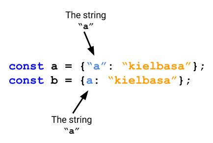

# Objects in JavaScript: A Pragmatic Approach

## Learning Objectives

After this lesson you should:

1. Be able to create objects
2. Know the difference between dot and bracket object access notation
3. Be able to iterate over the properties and keys of an object
4. Understand that objects are stored by reference, not by value

## I. Introduction

This article covers the fundamentals concepts of objects in JavaScript. Objects in JavaScript are an extremely useful and ubiquitous programming construct. Below is a graphical representation of the concepts that will be presented in this article.



Remember that JavaScript has 7 data types:

* string
* number
* boolean
* null
* undefined
* object
* symbol

Every **value** or **expression** in JavaScript is either:
* one of these data types, or
* derived from these data types

A JavaScript object is a collection of key-value pairs. The keys are called **keys** and the values are called **values**. Key-value pairs are separated by commas (`,`) are called **properties**. Keys and values are separated with a colon (`:`).



Objects allow a programmer to store information and quickly and efficiently look that information up at a later time. They are like a filing cabinet in this regard. Using an alphabetized filing cabinet you could quickly look up all files starting with the letter "A". Conceptually a property should be thought of as a unique identifier for some data - this data is the value for a given property.

JavaScript objects are really just associative arrays implements as hash tables.

## II. Creating Objects

In JavaScript there are two main syntaxes for creating objects:

* Object literal syntax
* Object constructor syntax

### a. Object Literal Syntax

Using **object literal syntax** you create an object using an opening - `{`- and closing - `}` - curly brace. Below is an empty object literal.

```js
{}; // creating an obj using object literal syntax
```

### b. Object Constructor Syntax

Using **object constructor syntax** you create an object using the `new` keyword along with the `Object()` constructor method. Below is an empty object.

```js
new Object(); // Object() is a constructor function
```

---
#### Exercise (3 minutes) 

Create a new object with two properties:
  1. `name` - your name
  2. `favColor` - your favorite color
---

#### new Keyword and Constructor Functions

A *constructor function* is a general computer science term. A constructor function is simply a function that creates (or returns) an object. Here is an example of a constructor in JavaScript:

```js
function ConstructMe(name, age) {
  return {
    myName: name,
    myAge: age
  }
}

console.log(constructMe("Jon", 23)) //=> {name: "Jon", age: 23}
```

By convention constructor function's names begin with a capital letter and they should only be executed with the `new` keyword.

### c. Reference vs. Value Types

We can assign objects to variables like so:

```js
const cs = {"machine learning": "fun", "compiler theory": "super fun!"};
```

Objects are complex types as opposed to primitive types. Complex types are stored by reference while primitive types are stored by value. When we store a primitive type such as a string the variable is bound to the value of the string. When we store complex types to variables the variable is **NOT** bound to the object itself but is instead bound to a location in memory for that object.

```js
let str1 = "cat"
let str2 = "cat"
str1 === str2 // true

const obj0 = {}
const obj1 = {}

obj0 === obj1 // false
```

Note that we can modify an object that is bound to a variable initialized with `const`, but WE CANNOT modify a string initialized with a const declaration.

```js
const a = "foo"
a += "bar"// Syntax Error

const obj = {}
obj.a = "cracker" // obj = {a: "cracker"}
```

---
#### Exercise (3 minutes) 

Consider the following JS code.

```js
let me = { name: "Jon", age: 24 };
let evilTwin = me;

me.age += me.age;
```

After this code snippet runs, what is `evilTwin`?

---

## III. Accessing Data from an Object

Let's say you wanted to store some information about your two favorite people. The data you want to store is:

* Instructor name
* Instructor age
* Instructor's favorite album

```js
const favoriteInstructors = {
  Jim: {
    age: 55,
    "favorite album": "The Dark Side of the Moon"
  },
  Jon: {
    age: 24,
    "favorite album": "Purple Rain"

  }
}
```

---
#### Exercise (3 minutes)

Using the object above how would we access Jim's favorite album? How would we access Jon's age?

---

There are two ways to access the value of some property from an object:

  * **Dot notation** which uses a `.`
  * **Bracket notation** which uses a bracket `[]`

### a. Dot Notation

We can access Jim and Jon's ages using dot notation:

```js
favoriteInstructors.Jim.age //=> 54
favoriteInstructors.Jon.age //=> 23
```

Dot notation provides a clean syntax for accessing properties on objects, but has two limitations that bracket notation addresses. As just demonstrated you can chain *dot notation* lookups to access properties in nested objects.

### b. Bracket Notation

Since dot notation requires one less character you should tend towards using dot notation over bracket notation in most cases. The only situations where you should use bracket notation are when:

1. the property name is contained in a variable and consequently needs to be dynamically looked up
2. the property name contains a space or dash

You can't use dot notation to look up the `favorite album` property.

```js
favoriteInstructors.Jim."favorite album"; //=> SyntaxError
favoriteInstructors.Jim["favorite album"]; //=> The Dark Side of the Moon
```

The other situation we need to use bracket notation is when the property is bound to a variable.

```js
const myName = "Jon";
favoriteInstructors.myName //=> undefined
favoriteInstructors[myName] //=> {age: 23, "favorite album": "Salad Days"}
```
With bracket notation the JS Engine knows to look up the value of the `myName` variable if no `myName` property exists inside the object.

**Note**: If you do a lookup on a property is *NOT* inside an object no error is thrown. Instead, `undefined` is returned.

---
#### Exercise (4 minutes)

Given the object below, how would you log out each value in the object?

```js
let me = { a: "i", b: "like", c: "coconuts" }
```
---

### IV. Adding, Deleting and Modifying Object Values

#### a. All Properties are Strings

All properties are strings inside in an object even those that aren't surrounded with quotes.



#### b. Delete Properties

To delete a property-value pair from an object use the `delete` operator:

```js
const obj = {a: "b"}
delete obj.a
console.log(obj) //=> {}
```

#### c. Adding New Properties

To add a property to an object you can simply use dot or bracket notation:

```js
const newObj = {}

newObj.a = "cats"
newObj["food"] = "yummy"

console.log(newObj) //=> {a: "cats", food: "yummy"}
```

#### d. Modifying Currently Existing Properties

To modify a value we can just re-assign its value:

```js
const anotherObject = {a: "old value"};
anotherObject.a = "new value"
console.log(a) //=> {a: "new value"}
```

### V. Iterating Over Objects & Checking Membership

#### a. Iterating Over Objects

To iterate through an object use the `for...in` syntax:

```js
var obj = {0: "first", 1: "second"}

for (var key in obj) {
  console.log(obj[key])
 }

 // This returns first then on the next line second
```

Note that we *had* to use bracket notation here because key is a variable that must be evaluated before property lookup.

#### c. Checking Membership

We can use the `in` keyword to determine if a object contains a given property. The general form of this is:

`<property> in <object>`

Here's an example:

```js
const box = {jack: "MOOOO"}
"jack" in box //=> true
"jill" in box //=> false
```

Also, sometimes it's useful to know the type of data you are working with. JavaScript has a useful operator named
`typeof` which you can use to determine the type of value you are working with.

```js
var me = {}
typeof me //=> returns "object"
```

### VI. Methods, Getters and Setters

#### a. Methods

You can add functions to objects and later invoke them:

```js
const foo = {
  "name": "Jon",
  hello: function() {
    return "hello"
  }
}

foo.hello() //=> "hello"
```

You may also want the function to do something using the data from an object. This is where using `this` may come in handy:

```js
var cats = {
	sound: "meow",
  makeSound: function() {
  	console.log(`Cats go ${this.sound}`)
  }
}

console.log(cats.makeSound()) //=> Cats go meow
```

`this` refers to the current object. So in this example `this` refers to the `cats` object. This makes sense because `this.sound` evaluated to "meow".

## Conclusion 

You now know how to store and retrieve data that lives in objects. This is indispensible knowledge. That is all.
