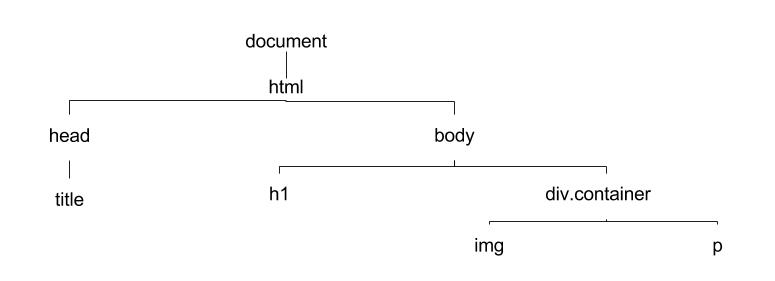

# DOM Selectors

## Learning Objectives

Students will be able to:

* Understand what the DOM is 
* Select DOM Nodes based on `class` and `id`
* Insert text and HTML into the DOM

---

## What's The Document Object Model

 - When a web browser "receives" some HTML it reads or *parses* the HTML and creates an in-memory representation of this HTML called the **Document Object Model** or **DOM**. 

 - The DOM is represented using the tree data structure:


- Trees are comprised of two entitities: 
	* nodes: contains data
	* edges: denotes a relationship between nodes

- The **root** node of the DOM is the `document` node. Consider the `html` document.

```html
<!doctype html>
<html>
<head>
  <title>Learning the DOM</title>
</head>
<body>
  <h1>Title</h1>
  <div class="container">
    
    <p>Text</p>
  </div>
</body>
</html>
```

- When this document is rendered by a web browser the web browser creates an in-memory model that looks something like this:



- This in-memory model is the browser's implementation of the Document Object Model. 

- All major browser vendors have coded an implementation of the Document Object Model into their browsers.

- If we open up the "Console" panel on the Chrome DevTools and type,

```js
document
```

we get a JavaScript object returned. 

**Question**: How would we verify that `document` is an object?

- Each node on the DOM is really just a JavaScript object with properties and values. Let's explore some of `document`'s properties:

```js
document.children
```

You can see that `document` has a `children` property with a value of `html`. To see the actual HTML of the web page type in:

```js
document.children[0]
```

Basically the DOM is an API that allows us to manipulate a web page.

### Setup

Let's build a nice little application.

* We're going to need an `index.html` for the markup and an `app.js` for the JS.
* Put `app.js` into a separate `js` directory and load it in the `<head>` with a `<script>` element.
* Finally, let's add the boilerplate and an `<h1>` to `index.html` as follows:

```html
<!DOCTYPE html>
<html lang="en" id="">
<head>
	<meta charset="UTF-8">
	<meta name="viewport" content="width=device-width, initial-scale=1.0">
	<meta http-equiv="X-UA-Compatible" content="ie=edge">
	<script src="./js/app.js"></script>
	<title>Document</title>
</head>
<body>
	<h1 id="title">DOM Selection</h1>
</body>
</html>
```

---

### Why Select DOM Elements?

* web apps today are dynamic - they respond to a user's interaction.
* for example, in a To-Do app, the user types a new todo into an input, clicks a button and the new todo is added to the list.

- The above scenario requires the app's JS to:
	-  Attach an event listener to the button element
	-  Grab the text entered from the input element
	-  Create a new element, e.g. an `li`, and set it's content
	-  Append that new element to the list

- JS must be able to select DOM elements so that the above steps can be performed!

---

### Select a single element by its _id_

- We select a single element by its `id` as follows:

	```js
	var titleEl = document.getElementById('title');
	console.log(titleEl);
	```

- Note that **you do not put a # in front of the id name**!

- Okay, save and view the page. Yikes! It just logs out `null` - what's wrong?

- The problem is that the script is running **before** the DOM is ready.

- There are a few ways to fix this...

---

### Select a single element by its _id_

- To fix this problem, we could:
	- Put our code in an event listener that is trigged when the `ondocumentready` event is fired.
	- Assign a function to the `window.onload` property.
	- We can add the `defer` attribute to our script tag so it defers running our script tag until *all* of the HTML has been parsed
	- Or we can simply move our `<script>` element to the bottom of the `<body>` element as follows:

```html
<body>
	<h1 id="title" class="cool">DOM Selectors</h1>
	
	<script src="js/app.js"></script>
</body>
```

- Until we learn more about events, let's move our `<script>` tag!

---

### Select a single element by its _id_

- Okay, let's refresh and bam, there's our element in the console!

- If you'd like to be able to explore the properties of element, use `console.dir()` instead.

---

### Select a single element using a CSS selector

- Using `document.getElementById` is the most common and efficient way to select an element if it has an id.

- However, much of the time, elements will not have an id assigned, so what do we do?

- The solution is to use the `querySelector(selector)` method that is available on the `document` **and** elements themselves.

- The _selector_ is a string that follows the syntax of regular CSS3 selectors - very powerful and flexibile! 

---

### Select a single element using a CSS selector

- Knowing that the _selector_ provided to `querySelector(selector)` follows the rules of CSS3 selectors, **how can we modify our code to select the `<h1>` element by its id?**

- Since `querySelector()` could match multiple elements, note that it  returns the **first matching** element. If no matching node is found, `null` is returned.

- You can also call `querySelector()` on an element to search its descendants only!

---

### Exercises

* In `index.html`, add a `<p>` tag with some content below the `<h1>`.  Also, give it the class of `cool`, then...
* Use `querySelector()` to select the first element with a class of `cool` and log it out.
* **Which element was selected?**

---

### Change the content of an element

* Now that we are able to select an element, let's see how we can change the content of that element.

* Inspecting the properties in the console, we will find a couple of properties that we can use to read and set content:
	- **`innerHTML`** - Content will be set as HTML
	- **`textContent`** - Content will be set as text

---

### Change the content of an element

* Let's check out changing content of our `<p>` element by assigning the string **_Comments for \<strong\>Today\</strong\>_** first to `textContent`, then to `innerHTML`.

* So, as you saw, if you want to include HTML in the content, use `innerHTML`.

* The power of `innerHTML` may not be obvious, but consider that the string can be as complex as you want, even containing multiple elements with attributes, etc.

* Using `textContent` is more efficient if just setting text.

---

### Change the style of an element

* DOM elements also have a `style` property that can be used to get/set CSS styling!

* Check out the CSS properties in the console.

* **What naming convention is used for CSS properties in the DOM?**

* **What naming convention is used for CSS properties in CSS?**

* **Why is it different?**

---

### Change the style of an element

* This is how we can set the `text-align` CSS property of our title:

```js
var titleEl = document.getElementById('title');
titleEl.style.textAlign = 'center';
```

* **Your turn:** Change the text color of the `<p>` element to green - try to do it in one line of code.

* Note: Setting styles in JS like this is implemented using the `style` attribute (inline styling).

---

### Attributes of an element

* You may need to get, set, or check if an element has a certain attribute.

* The element's API has several methods to work with attributes:
	* `getAttribute`
	* `setAttribute`
	* `hasAttribute`

* For details, here's a [link to the entire API for elements](https://developer.mozilla.org/en-US/docs/Web/API/element).

---

### Review Questions

- **If we want to change text only inside of a `<div>`, what property should we set?**

- **How many DOM elements are returned by the `querySelector` method?**

- **The `querySelector` method is available on the ______ and _______.**

---

### Selecting multiple elements
<br>

- Now let's see how we can grab multiple elements.

- The methods will return either an _HTMLCollection_ or a _nodeList_.  Both are special objects that behaves much like an array.  We will discuss a key difference later.

- Let's add this HTML below the `<p>` element (use Emmet):

	```html
	<ul id="comments">
	  <li class="comment">first comment</li>
	  <li class="comment">second comment</li>
	  <li class="comment">third comment</li>
	</ul>
	```

---

### Selecting multiple elements

- These methods are used to select multiple elements:
	- `getElementsByTagName()`
	- `getElementsByClassName()`
	- `querySelectorAll()`

- Like `querySelector()`, these methods are available on the `document` object or any element (great for focusing the selection).

- If a method above does not select any elements, it will return an empty array-like collection.<br>**How is this different from what the single-element methods returned?**

---

### Select multiple elements<br>by their tag name

- The first method we'll look at that selects multiple elements is <br>`getElementsByTagName(name)`

- Let's grab all of our `<li>`s:

```js
var comments = document.getElementsByTagName('li');
console.log(comments);
```

---

### Select multiple elements by their tag name

- Now you can access each element using _square bracket notation_ just like on arrays:

```js
> comments[1]
<li class="comment">second comment</li>
```

- In a bit, we'll look at how to iterate through the list.

---

### Select multiple elements by their class

- Just like `getElementsByTagName(name)`, we can use `getElementsByClassName(names)` to select elements, but by their class instead of their tag name.

- Note that if you want to select elements having more than one class, just separate the classes with a space like so:

```js
var el = document.getElementsByClassName('menu sidebar');
```

Only elements with **both** _menu_ and _sidebar_ will be selected

---

### Select multiple elements with querySelectorAll()

- Finally, providing maximum flexibility, is the `querySelectorAll` method that uses CSS3's selector language like we saw earlier with the `querySelector` method.

- **Practice:** In the console, use `querySelectorAll()` to select all of the elements with a class of `comment`.

---

### Live vs. non-live (static) lists

* `querySelectorAll` returns a _nodeList_.

* `getElementsByTagName` and `getElementsByClassName` return an _HTMLCollection_.

* The difference between the two types of array-like objects is that the _HTMLCollection_ is **_live_**, which means the collection is automatically updated as the DOM changes!

---

### Iterating over a collection of elements

- Unfortunately, both _HTMLCollection_ and _nodeList_ do not have a `forEach` method to iterate over its elements.

- However, a `for` loop's looping variable can be used to index into the list using square bracket notation like this:

	```js
	for(var i = 0; i < comments.length; i++) {
		console.log(comments[i]);
	}
	```

---

### Iterating over a collection of elements using ES2015

- ES2015 (formerly known as ES6) brings us a better way to iterate:

	```js
	for (let comment of comments) {
		console.log(comment);
	}
	```

- We will be gradually introducing ES2015 features throughout WDI.

---

### Final Questions

- **What was the one method used to select an element that is available on the `document` object only (not elements)?**

- **Which property on DOM elements contains the CSS properties for that element?**

- **If we wanted to grab all of the content (including its nested elements) of an element as a string, what property would we use?**

- **What two methods provide the most flexibility when selecting a single and multiple elements?** 

---

## Lab


- Remember that **To Do App** scenario we discussed early in the lesson?<br><br>**Why not give it a go?**

---

## References
<br>

- [Locating DOM Elements using Selectors](https://developer.mozilla.org/en-US/docs/Web/API/Document_object_model/Locating_DOM_elements_using_selectors)

- [Intro to the DOM on MDN](https://developer.mozilla.org/en-US/docs/Web/API/Document_Object_Model/Introduction)


