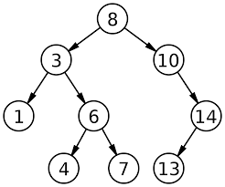

# Binary Trees 

A **Binary Tree** is a data structure comprised of nodes and edges that connect nodes. Here is a diagram of a binary search tree:

Some terms you should be aware of:

* Each one of the circles in the above diagram are called **nodes**
* A node that is directly above another node is called a **parent node**
* A node that is immediately below another node is called a **child node**
* A Binary Search Tree is composed of many **subtrees**

There are some rules or **invariants** a Binary Search Tree obeys. These invariants are rules that specify *what* the relationship between nodes will look like:

1. The values of the nodes in the left subtree are less than the values of the parent node
2. The value of the nodes in the right subtree are greater than the values of the parent node
3. There are no nodes with the same values

## Exercises 

1. Complete the `doesNodeExist` class method. This method should accept a value and node as inputs and return `true` if that value is in the tree *or* subtree and `false` otherwise.

2. Complete the `min` and `max` class methods. These should find the minimum and maximum values - respectively - in a tree.