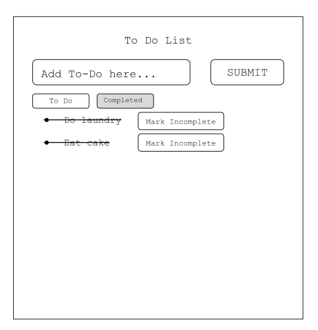

# Building a To-Do App

## Introduction

**Goal**: Build a To-Do application using HTML, CSS and JavaScript. You may also use jQuery if you'd like. **Do not use any other libraries.**

### Wireframes 




### User Stories 

AAU I want to be able too... 

* Type my To-Do's into an input field 
* Be able to submit my To-Do's and have them appear in list form 
* Mark a To-Do as "completed"
* See a list of *only* my completed To-Do's 
* Change the status of a "completed" To-Do to "incomplete"

### Deliverables 

Please create a GitHub repository and store all code in this repository. Send a link to your finalized To-Do application to Jim **and** Jon before 5:01 PM today.

### Developer Notes 

The state of your application should look like this: 

```js
var state = [
    { 
        todo: "Buy Milk", 
        todoStatus: "incomplete" 
    }, 
    {
        todo: "Eat beans", 
        todoStatus: "complete"
    }
]
```

Use [this](https://github.com/ga-students/wdi-dt-57/blob/master/work/w01/d5/03-guide-to-building-a-browser-app.md) guide when building your application.

Please have the following in your code: 

* `state` - the state of your application 
* a `render` method used to display your state to the user