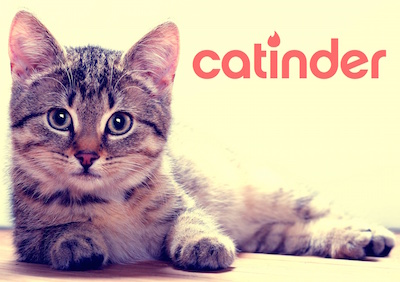
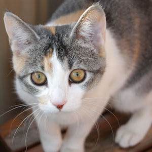
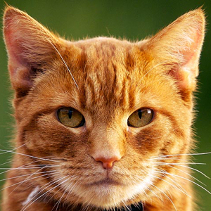
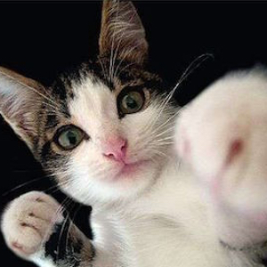
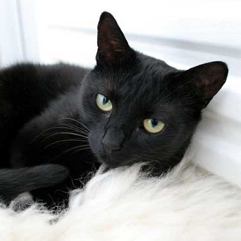
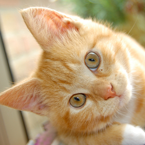
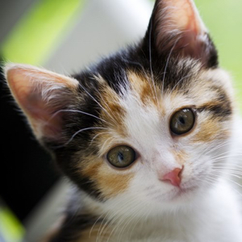
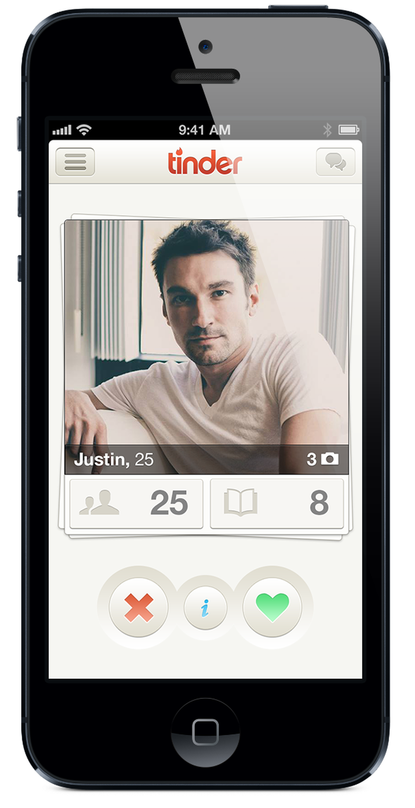

# CaTinder



> It's a fight; which *cat*-ender will win!?

Tonight we will use our knowledge of the Rails web application framework
to build a "feature subset" of everyone's favorite new start-up: 
CaTinder!

## Setup

**Work outside of the class repo!**

Create a new Rails app named `catinder`. 

If you get stuck, you can check the class repo resources/cheatsheets folder, read docs, review the in-class lessons, google, etc.

**Please finish through Part One at least.** Try to get through 
**Part Three**.

As always: more is better; healthy living is best. Only do the bonus if 
you have completed every single part.

---

### Part 0: Create a Root Route

#### Root Route (`GET /`)

Build a welcome page for the website, and make it visit the controller
and action `welcome#index`. You can do this simply in `/config/routes.rb`,
in fact, the example is in the comments code that comes in the file!

```ruby
root "welcome#index"
```

This page should say:

```
Welcome to CaTinder!

Pets start here.

Who is Meow, and who is Not-Meow? You decide!

get started >
```

By clicking on the "get started" *link* on the page, you go to 
`/cats?random=true`. This will give us an error, since we haven't 
implemented it, but that's just fine!

#### Integrate Bootstrap

Install Bootstrap on your app. 

Now, make sure that your app has a [menu/nav bar][nav], a large logo,
and the above text. Finally, add some images of cats. You can model 
it off of the [current Tinder homepage](https://www.gotinder.com) 
(archived [here](assets/tinder-page-example.png) in case it changes).

**[Here is a working example.<br>](https://calm-depths-4274.herokuapp.com/)**

**Note:**

- There are assets available in the `/assets` folder here, including
  a logo and some images.
- Put any images in to `/app/assets/images`, and check out how to use 
  [`image_tag` helpers to include images](http://guides.rubyonrails.org/layouts_and_rendering.html#asset-tag-helpers).
- The above example is using the font **Lato 300** from Google Fonts.

---



### Part 1: Generate the Application's Model

Implement the following ERD with an ActiveRecord migration and model.

| Cat |
| :-: |
| name (string) |
| image_uri (string) |
| votes (integer) |

This application uses straightforward, single, CRUD logic. A
seed file (`seeds.rb`) has been provided that you can run to put some cats in the database.

---



### Part 2: Cat Read Routes (INDEX & SHOW)

#### Cat List, aka Index Cats (`GET /cats`)

A list of the cats! Show the picture and number of votes for every cat 
in the database!

#### Cat Page, aka Show Cat (`GET /cats/:id`)

This will show a single cat from the database. The param `:id` is the 
cat's id. Make sure to show the image and the number of votes.

---



### Part 3: Adding Custom Logic (`GET /cats?random=true`)

The `?random=true` is a [query string](https://en.wikipedia.org/wiki/Query_string).  The query string is the part of the URL after a `?`.  The query string consists of one or more key/value pairs (separated by an `=` character). Multiple key/value pairs are separated by the `&` character.  Rails will add each key to the `params` hash so that you will be able to access its value like this: `random = params[:random]`.

Now, when we go to the cats index route (`GET /cats`) if there is a param 
`random` set to `true`, **redirect** to a cat show page (`GET /cats/:id`) that shows a random cat. We redirect if we want the browser to issue a new request, which of course will be processed by the Rails app. If you want to know how to redirect, check either an example "scaffold" of a resource, or google it.

Next, on every cat's show page (`GET /cats/:id`), make sure there is a 
link to `GET /cats?random=true` with the title "**Next Cat**".

---



### Part 4: Cat Create Routes (NEW & CREATE)

#### Cat Form, aka New Cats (`GET /cats/new`)

Use a `form_for` helper to build a standard cat creation form.

#### Cat Addition, aka Create Cats (`POST /cats`)

Implement strong parameters (ie, whitelisting) and a `cats#create`
action that will add a new cat and redirect to its show page!

---



### Part 5: Vote! (`PUT /cats/:id`)

Add the update action to our application (`cats#update`)!

Add a button to the cat's show page (`GET /cats/:id`) that goes to that
cats' update route with the param `vote=true`. When we do this, two
things happen:

1. this cat is up-voted in the database, and
1. we redirect to another random cat with `GET /cats?random=true`

---



## Bonus: HTML &amp; Styling

Make your page look like Tinder's! Example:

   
<caption>Click on the above to see a larger example.</caption>

You can find the symbols used above [right there in Bootstrap][glyphs]!

<!-- LINKS -->

[glyphs]:  http://getbootstrap.com/components/#glyphicons
[nav]:     http://getbootstrap.com/components/#navbar-fixed-top
[example]: https://github.com/h4w5/example_video_app/blob/master/app/controllers/music_videos_controller.rb#L16
