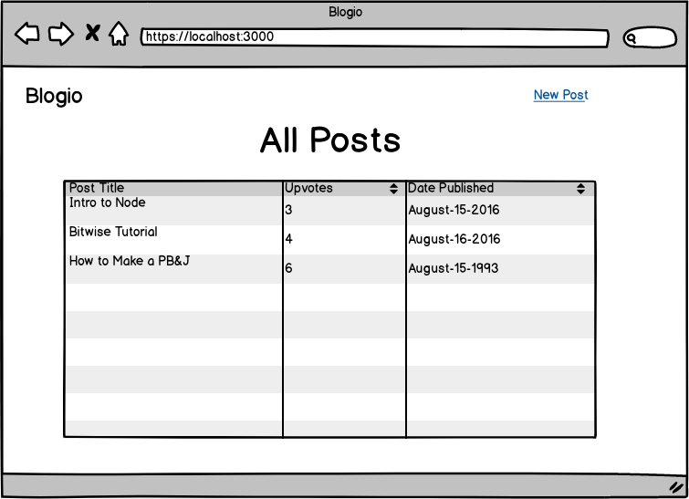
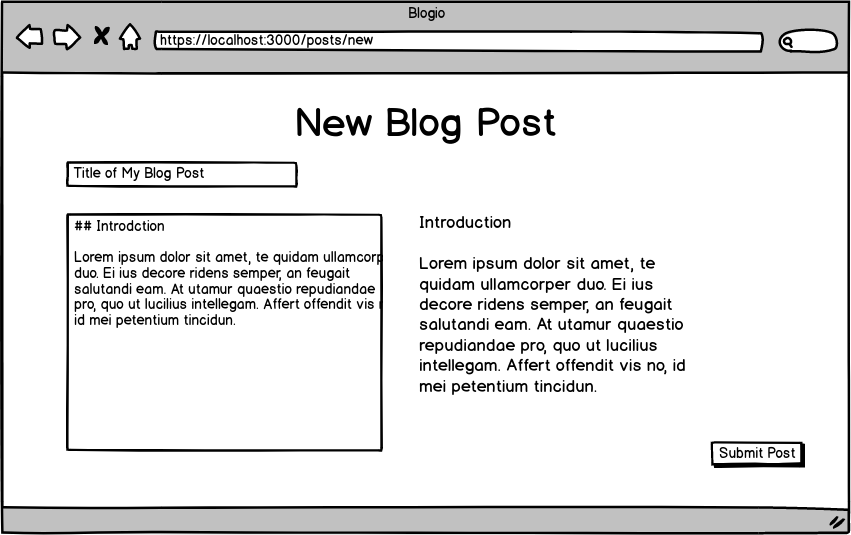
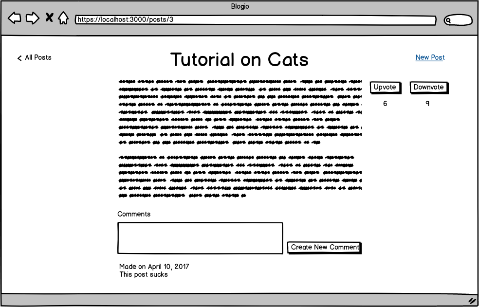

# Rails Blog 

## Overview 

**Goal**: Build a simple blog using Ruby on Rails.

I will provide the data models, wire frames and desired functionality.  

## Data Model 

This application should have two models: 

1. Post 
2. Comment 

Below is the Entity-Relationship Diagram (ERD) for this application.

 

Things to note: 

* Each post has many comments 
* All posts and comments are anonymous

## Designs 

This application should consist of three pages. 

---

Design notes: 

* Users should be able to filter posts by upvotes (in either ascending or descending order) and by data published (in either most-recent to least-recent order or least-recent to most-recent order)

---

Design notes: 

* User should be able to enter the title of the post and the content of the post 
* **OPTIONAL**: Allow users to write posts in markdown and have their markdown posts be dynamically previewed

---

Design notes: 

* Users should be able to upvote and downvote posts
* Users should be able to make a new comment. When a user submits a new comment the page should refresh and the user should stay on the same page. 

