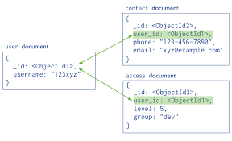
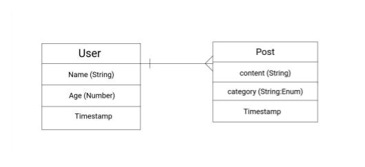

Slides for this lecture can be found [here](http://slides.com/jonathantamsut/mongodb-data-modeling-embedding-v-referencing).

# Data Modeling with MongoDB

## Learning Objectives

By the end of this lecture students should be able to:

* Understand the difference between **embedding** and **referencing** in MongoDB
* Know how to implement a one-to-many association in Mongoose using both embedding and referencing
* Know how to use the `populate` method to access referenced documents

## Introduction 

This lecture reviews embedding and referencing in MongoDB and provides a tutorial for how to implement these associations using the Mongoose Object Document Mapper (ODM). We will also get further practice building RESTful CRUD applications using Express and Mongoose. 

## What is Data Modeling?

An effective data model is one that allows you to access data from your database *quickly* and *easily*.

## Review

* Data in MongoDB has a flexible schema
* Unlike SQL databases where you must determine and declare a table’s schema before inserting data, MongoDB’s collections do not enforce document structure

## Normalized vs. Denormalized Data

Roughly speaking a **normalized** data set has no redundant data, while a **denormalized** data set has some duplicates of data.

## Recap: References vs Embeds

#### References

**References** store the relationships between data by including links or references from one document to another. Applications can resolve these references in multiple queries to access the related data. 

Broadly, these are normalized data models.



#### Embedded Data

**Embedded** documents capture relationships between data by storing related data in a single document structure. MongoDB documents make it possible to embed document structures in a field or array within a document. These denormalized data models allow applications to retrieve and manipulate related data in a single database operation.


---

### A Sick-Nasty Tutorial: Building an Application Using Embedding, Then Referencing!

**This is the game plan**: I have given you starter-code for a simple "blogging" application. This application isn't finished yet!

Please spend 8 minutes familiarizing yourself with the code in the `starter-code` project. 

What we need to finish is: 

- [ ] The views in <code>views/users/index.ejs</code>, <code>views/users/new.ejs</code> and <code>views/users/show.ejs</code></br>

- [ ] Our controllers in <code>controllers/postsControllers.js</code> and <code>controllers/usersControllers.js</code></br>

- [ ] Our models in <code>models/post.js</code> and <code>models/user.js</code>

**We are going to first build out the schemas to use embedded references. We are then going to *refactor* our schemas to use referencing.**

#### Application Description

This application will have two models: 

1. Posts
2. Users. 

There will be a one-to-many relationship between users and posts. The Entity-Relationship Diagram for this model is below:



All of the routes for this application are described in the table below:

| HTTP Verb | Path                 | Controller Action |
|-----------|----------------------|-------------------|
| GET       | /users/new           | users#new         |
| POST      | /users               | users#create      |
| GET       | /users/:user_id           | users#show        |
| POST      | /users/:user_id/posts     | posts#create      |
| DELETE    | /users/:user_id/posts/:post_id | posts#destroy     |

### Application: Embedding 

Let's start off by creating our User and Post model using embedding.

#### Embedding Subdocuments

A document embedded inside of another document is called a **subdocument**. The easiest and probably most common way to create a one-to-many association using Mongoose is through embedding. 

Let's consider an example. With this approach we embed *schemas* within *schemas*. Let's consider a `Blogpost` schema that has many `Comments`:

Emdedding documents using Mongoose:

```javascript
const Comments = new Schema({
    header     : String,
    content      : String,
    date      : Date
}, {
    timestamps: true
});

const BlogPost = new Schema({
    title     : String,
    body      : String,
    comments  : [Comments],
}, {
    timestamps: true
});

mongoose.model('BlogPost', BlogPost);
```

We use square brackets `[<Schema Name>]` to denote that many `Comments` are in a single `BlogPost`.

Below, is how you *add* an embedded document to an array:

```javascript
  // retrieve my model
const BlogPost = mongoose.model('BlogPost');

// create a blog post
const post = new BlogPost({ title: "Cat", body: "Yeehaw! Sandos!" });

// create a comment
post.comments.push({ header: 'My comment', content: "What!?"  });

post.save(function (err) {
  if (!err) console.log('Success!');
});
```

This is how you remove an embedded document and search for one by `id`:

```javascript
BlogPost.findById(myId, function (err, post) {
  if (!err) {
    post.comments[0].remove();
    post.save(function (err) {
      // do something
    });
  }
});

post.comments.id(my_id).remove();
post.save(function (err) {
  // embedded comment with id `my_id` removed!
});
```

Things to note above: 

* We can treat `post.comments` as an array and use the Mongoose `push` method to bush an embedded document into its parent document 
    - We must save the *parent* document in order for the embedded document to be saved
* The `remove` method removes child documents
* `DocumentArrays` have an special method `id` that filters your embedded documents by their `_id` property (each embedded document gets one)

#### Lab (10 minutes): Create Embedded Schemas

Using what we just learned build the schemas for posts and users. You should be writing your code in the `models` directory. 

**Note**: At the end of the 10 minute period we will go over the solution as a class. We will then code our our controllers and views to make this a fully functioning application!

### Application: Referencing 

Ok, now let's try that again but this time using referencing instead of embedding. Inside of the `User` model we will provide a reference to a `Post`.

#### Modeling One-to-Many Relationships with Document References

Consider the following example that maps `Product` and `Order` relationships. The example illustrates the advantage of referencing over embedding to avoid repetition of the products information.

```js
const mongoose = require('mongoose');

const orderSchema = new mongoose.Schema({
    products: [{type: mongoose.Schema.Types.ObjectId, ref: 'Product'}]
});

const Order = mongoose.model('Order', orderSchema);

const productSchema = new mongoose.Schema({
    name: String,
    price: Number
});

const Product = mongoose.model('Product', productSchema);
```

**Quiz**: What is our one? What is our many?

This is how we would use referencing:

```js
const product = new Product({name: 'Wrench', price: 5});
product.save();
const order = new Order()
order.products.push(product)
order.products // ["57ec7d5cf292421828791b8b"] // just the objectId
```

If we were to query for a single order we would get back the following:

```js
{
    _id: '57ec7d63f292421828791b8c',
    products: [ '57ec7d5cf292421828791b8b' ]
}
```

In order to obtain the referenced documents we need to call `populate` on the query.

```js
Order.findById(id).populate('products').exec(function(err, order){
    console.log(order);
});
```

The `populate` allows you to access another document in a given collection other than the one you are currently query which would yield:

```js
{ _id: '57ec800a3130441eb4b52e39',
  __v: 0,
  products:
   [ { _id: '57ec800a3130441eb4b52e38',
       name: 'Wrench',
       price: 5,
       __v: 0 } ] }
```

#### Lab (10 minutes): Create Referenced Schemas

Try to re-write the schemas in the `models` directory to use referencing. We will go over the solutions as a class and then we will modify the controllers accordingly.

### When to Embed? When to Reference?

* Both embedding and referencing have their strengths and weaknesses.
* Unlike the strict structure of relational DB's, data modeling in MongoDB is more art than science due to MongoDB's unique flexibility
* Without going into to much detail, here is a quick recap of some of the key points of when to use either referencing or embedding when considering your application's data model:
    - Use referencing when you have a many-to-many relationship
    - Use embedding when the sub-document always appears with its parent (e.g., a comment *ALWAYS* belongs to a single blog post) or, more generally, when you have a one-to-many relationship

## Embedded and Referencing Documents

Here are some guidelines to consider when deciding on referencing vs embedding from the MongoDB docs:

1. Favor embedding unless there is a compelling reason not to
2. Needing to access an object on its own is a compelling reason not to embed it
3. As always with MongoDB, how you model your data depends – entirely – on your particular application’s data access patterns. You want to structure your data to match the ways that your application queries and updates it