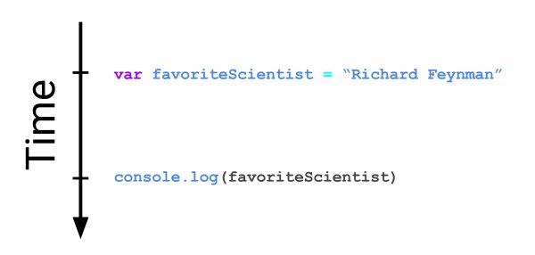
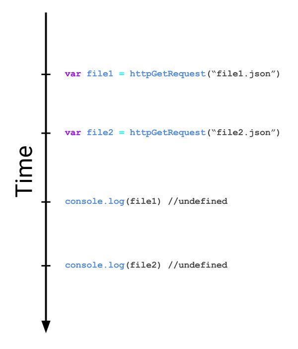
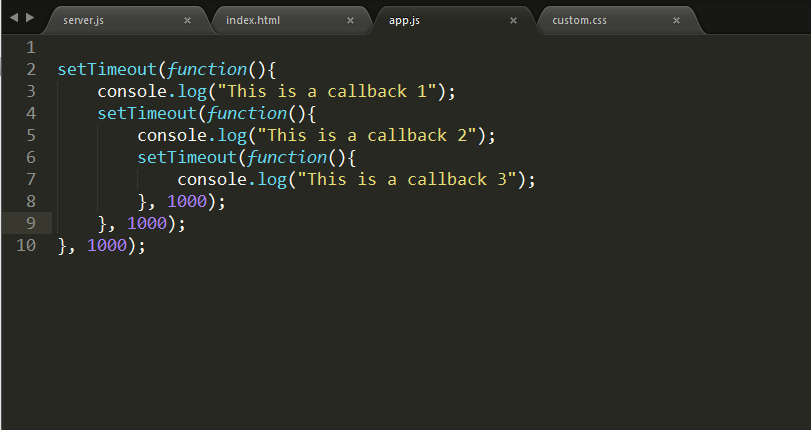

# An Introduction to JavaScript Promises

Slides for this can be found [here](http://slides.com/jonathantamsut/promises).

## Learning Objectives

  * Understand the difference between asynchronous and synchronous code
  * Know how to use Promises to write asynchronous code
  * Know the 3 states a Promise can have
  * Know how to chain Promises to seed a MongoDB database using Mongoose

## A Re-Introduction to Asynchrony in JavaScript

Let's review some of the fundamental concepts of asynchronous JavaScript.

First of let's define the word **asychronous**.

Here is a definition of the word "asynchrounous" take from the Internet: 

> Of or requiring a form of computer control timing protocol in which a specific operation begins upon receipt of an indication (signal) that the preceding operation has been completed.

Based upon the above definition, in what way is JavaScript code asynchronous?

### The JS Engine is Single-Threaded

**Promises** are a tool we use to deal with asynchronous code. When we write code in JavaScript we make assumptions about the ordering in which our code will be executed. We assume the JS Engine reads our code from top to bottom.



Besides being read from top-to-bottom we also know JavaScript code is executed in a **single-threaded** environment. When we say our code is executed in a *single-threaded* environment we are referring to the fact that two different lines of code can't run at the *exact* same time.

Let's explore this further using the Chrome DevTools.

```js
function showType(data) {
    console.log('Now in the body of showType');
    console.log('We\'re on the next line');
    let type = typeof(data);
    return `This variable is type ${type}`;
};

console.log(showType('string'));
console.log(showType([1,2,3,4]));
```

If we place breakpoints on lines 2, 3, 8 and 9 we can actually observe the sequential nature of how our code is executed.

The single-threaded nature of JavaScript is accomplished via the **event loop**. The event loop places code that is not yet executed in a [queue](http://interactivepython.org/runestone/static/pythonds/BasicDS/WhatIsaQueue.html). The order in which code is placed on the queue is determined by the order in which the JS engine "sees" the code. When code is dequeued it is executed by the JS engine.

### Why Asynchronous Code and Callbacks

Many processes involved in building web applications require programmers to deal with asynchrony:

  * Making network requests (e.g., `GET`, `POST` and `PUT` requests)
  * Databases queries (e.g., `INSERT`ing into a database table)

Both of the above process take some amount of time to complete. How much time? We don't know. All we know is that they won't happen *immediately*.

When we make an HTTP request we do not know when, if ever, we will receive data in an HTTP response.

<center>The fundamental principle behind asynchronous code is that we cannot assume when this code will be run.</center>



We are used to handling asynchronous code using callbacks. Remember that callbacks are simply functions that are passed as parameters to other functions.

Let's consider a made-up asynchronous function named `makeHTTPGetRequest` that makes HTTP `GET` requests.

```js
makeHTTPGetRequest(requestObject, function(response, err) {
  if (response) {
    // do something with HTTP response
  }
  if (err) throw err;
});
```

The `makeHTTPGetRequest` function *registers* an anonymous callback function that is executed once `makeHTTPGetRequest` returns an HTTP response. Remember that the event loop is the mechanism by which the anonymous callback function is being executed.

Callbacks can unfortunately lead to code that is hard to write, hard to read and even harder to debug!



This occurs when you must write asynchronous code that must be executed in series. Promises offer a clearer syntax to write this kind of code. **Promises and callbacks play the same role in asynchronous programming. They are BOTH mechanisms you can use to execute code asynchronously**.

## Using Promises to Handle Asynchrony

### What's a Promise You Ask

A **Promise** is a mechanism by which we can write some code that "wraps" around some asynchronous code. We can then specify what happens when our asynchronous block of code is ready to be executed. Promises are a *native* JavaScript feature meaning that we can use them in the browser and in Node.js without including any additional libraries. The native JavaScript Promise is a **constructor** function meaning that it is a function that returns a JavaScript object.

We can actually log out this object in Chrome DevTools.

```js
console.log(new Promise((resolve, reject) => {}));
```

To create a new instance of a `Promise` we use the `new` keyword and pass a function to the Promise constructor that has two parameters:

  1. `resolve` - A callback function that is executed upon successful completion of our asynchronous code
  2. `reject` - A callback function that is executed upon unsuccessful completion of our asynchronous code

### Try, Catch and Promise

This structure is awfully reminiscent of a `try`/`catch` block. `try`/`catch` blocks are used for error handling. They allow you to "try" to execute some code, then "catch" an error if one arises.

* The `try` statement lets you test a block of code for errors
* The `catch` statement lets you handle an error

```js
try {
  consol.log('foo') // Error: consol NOT console
} catch(err) {
  console.log('You got an error dummy!');
  console.log(`Your error is: ${err}`)
}
```

### Our First Example

Now let's take a look at an example of a Promise.

```js
let myFirstPromise = new Promise(function(resolve, reject) {
	setTimeout(function() {
		resolve('Success!');
	}, 4000);
});

let returnedPromise = myFirstPromise.then(function(successMessage) {
	console.log('Yay!' + successMessage);
});
```

The above example illustrates a few things.

  * The `myFirstPromise` variable is bound to the object created by the `Promise` constructor function
  * The object that is returned as a result of calling a promise has a `then()` method that allows you to define what happens when the promise is resolved or rejected
  * The `resolve` function is called once the callback registered by the `setTimeout` function returns (this occurs after roughly 4 seconds)
  * The `then` keyword is part of the Promise syntax and allows us to specify what happens when `resolve` is called

The `returnedPromise` variable is equal to a `Promise` object which has a `[[PromiseStatus]]` property set to `"resolved"` only once the promise is resolved.

There are **ONLY** three states a promise can have:

  1. **resolved** - The action relating to the promise succeeded (e.g., `setTimeout` called `resolve`)
  2. **rejected** - The action relating to the promise failed (e.g., our HTTP `GET` request responded with a 404 error)
  3. **pending** - The promise has not been resolved or rejected

Once a Promise has either resolved or rejected we say it is *settled*. One really important thing to note is that a promise can only settle once. Once a promise is resolved it cannot re-resolve or become rejected. If a promise has succeeded or failed and you later add a success/failure callback, the correct callback will be called, even though the event took place earlier.

A Promise should have this general structure:

```js
var promise = new Promise(function(resolve, reject) {
  // do a thing, possibly async, then…

  if (/* everything turned out fine */) {
    resolve("Stuff worked!");
  }
  else {
    reject(Error("It broke"));
  }
});
```

### then

Once a promise has either been `resolved` or `rejected` you can do *something* with it. For example if you are making an API call you can:

  * If resolved you can take the data returned by the API call and display it to the user
  * If rejected you can re-make the API call or do some other error handling

The way you *do something* with promises is with `then()`. Then `then` method takes two parameters:

  1. A callback for a success case
  2. A callback for a failure case

### Promise Chaining

You can actually chain `then`'s together. When you alter the value of a promise it it passed into the next promise.

```js
const promise = new Promise(function(resolve, reject) {
  resolve(1);
});

promise.then(function(val) {
  console.log(val); // 1
  return val + 2;
}).then(function(val) {
  console.log(val); // 3
})
```

## Conclusion 

Promises are a useful mechanism to write asynchronous code in both client-side and server-side JavaScript. Check this out for [another](http://javascript.info/promise-basics) treatment of Promises. Many JavaScript libraries exist that help deal with asynchronicity. Once popular one is [async](https://github.com/caolan/async). A newer, improved syntax for dealing with promise based asynchronous code exists. Its called [async/await](https://javascript.info/async-await).