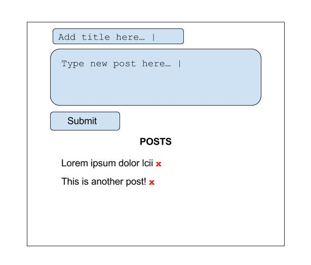

# AJAX with fetch API

Slides for this can be found [here](http://slides.com/jonathantamsut/client-side-api-requests-and-underscore-templating).

### Objectives

* Use the `fetch` API to make Promise-based XHR requests
* Understand how the `fetch` API returns a "thenable" Promise
* Understand the role XHR requests play in client side rendering

## What is AJAX? Introduction

**AJAX (Asynchronous JavaScript and XML)** is a method of building interactive applications for the Web that make HTTP requests without re-rendering a whole page. **Basically an AJAX call makes an HTTP request without refreshing the page**.

> **Example:** A weather forecasting site could display local conditions on one side of the page as soon as a user finishes typing in a zip code. The temperature could refresh every minute, without the user having to hit a refresh button.

In general the process looks like this – use JavaScript on the client side to hit an API (without reloading a page), then use the pure data you get back to manipulate the DOM somehow if you need to. This DOM manipulation can take the form of rendering a template (which we will cover in the next module!) or just changing a number on the page.

### Advantages of AJAX To Make HTTP Requests

What are some advantages of using AJAX: 

* A user has a more seamless experience with no page refreshes.
* Applications that make heavy use of AJAX can be built in a manner that completely decouples front-end and back-end code. To a front-end developer, the back-end can be viewed simply as a series of API endpoints that the front-end hits to get data from and send data to.

### Disadvantages

Some disadvantages of AJAX include: 

* When you render new content on a page (without refreshing the page) it can seem to the user that you are on a completely new page with a different URL and path even when you aren't. This may lead to a confusing experience for the user when using the back and refresh buttons.
* On sites where JS is disabled your AJAX simply won't work work.

## Same-Origin Policy and Cross Site Scripting 

The origin of an HTTP request is the URL of the page from which an HTTP request was made. It is composed of three things: 

1. The protocol (e.g., `http`, `https`)
2. The domain (e.g., `www.ilikecoconuts.com`)
3. The port (e.g., `3000`, `80`)

The **Same-Origin Policy** works to prevent malicious attacks by preventing code from another site executing on your site. An attack like this is known as a **Cross-Site Scripting (XSS)** attack. From Wikipedia: 

> [The Same-Origin Policy] states that if content from one site (such as https://mybank.example1.com) is granted permission to access resources on a system, then any content from that site will share these permissions, while content from another site (https://othersite.example2.com) will have to be granted permissions separately

### Cross-Origin Request Sharing (CORS)

A resource makes a Cross-Origin HTTP request when it requests a resource from a domain or port which is different from the one which the first resource itself serves. For example, an HTML page served from http://domain-a.com makes an `` request for http://domain-b.com/image.jpg. Many pages on the web today load resources like CSS style sheets, images and scripts from separate domains. For security reasons, browsers restrict cross-origin HTTP requests initiated from *within scripts*. **Cross-Origin Resource Sharing** (CORS) is a mechanism that uses HTTP headers to let a browser gain permission to access selected resources from a server on a different domain than the site currently in use. CORS essentially allows us to work around the Same-Origin Policy. We sometimes run into CORS errors when using the `fetch` API. There are a number of reasons why we may run into a CORS error: 

* The server we are requesting from simply does not allow CORS requests 
* We need to add a few headers in order for our CORS request to work

## The Fetch API

The `fetch` API has the following function signature: 

```js
fetch(<API Endpoint URL>, [ <options object> ])
```

The arguments of the `fetch` API are: 

* a required API endpoint 
* an optional options hash where you can specify certain things about your HTTP request (e.g., headers, body)

The **fetch** API allows us to make AJAX requests that return Promises. The `fetch` API takes only one *required* parameter: the URL of the endpoint you'd like to hit.

```js
fetch('https://jsonplaceholder.typicode.com/posts/1')
  .then(response => response.json())
  .then(json => console.log(json))
```

Copy and paste the above code into Chrome Dev Tools. What do you see?

The above code makes a `GET` request to the URL `https://jsonplaceholder.typicode.com/posts/1`. Whatever gets returned is specified by how the API deals with `GET` requests. We **must** convert our data to JSON so we can "play" with it using the `json()` method.

**What is returned by the `fetch` API is a Promise and is therefore "thenable".** The `json()` method **MUST** be used to convert data stream into JSON.

The second, optional argument we can pass to the fetch API is the `options` object. In the `options` object we can specify many things about our HTTP request such as: 

* headers
* content of the body 
* HTTP verbs

Please note that in order to make a `POST` request using the `fetch` API we **NEED** to set the `Content-Type` header to `application/json`. We can create headers using the `header` property in the `options` object.

```js
fetch('https://jsonplaceholder.typicode.com/posts', {
    method: 'POST',
    body: JSON.stringify({
      title: 'foo',
      body: 'bar',
      userId: 1
    }),
    headers: {
      "Content-type": "application/json; charset=UTF-8"
    }
  })
  .then(response => response.json())
  .then(json => console.log(json))
```

### Practice Using the fetch API 

Please take 10 minutes to familiarize yourself with the `fetch` API using the JSON placeholder API found [here](https://jsonplaceholder.typicode.com/). Write one request to `GET` some resources and another to `POST` some resources. Take a look at some of [these](https://github.com/typicode/jsonplaceholder#how-to) examples. Try out 2 of them. All code can be run in Google DevTools.

## In Class Activity

Use [this API](https://github.com/jtamsut/REST-api) to build a simple web application using Express that displays posts and allows users to submit posts. This application should be a single page:



Use  `setInterval` to "refresh" the list of posts every minute. [This](https://www.w3schools.com/jsref/met_win_setinterval.asp) is some information on `setInterval` that might be useful.