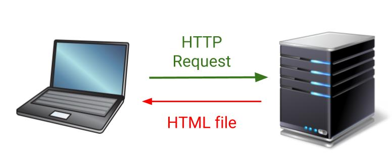
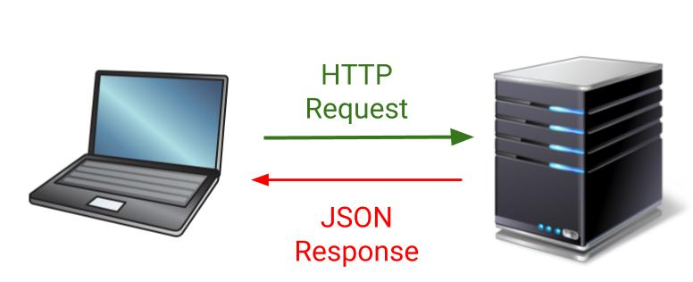
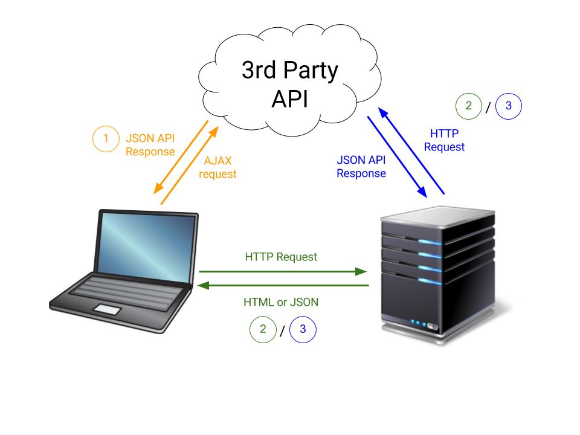

# Client-Side Rendering 

## Learning Objectives 

By the end of this lecture a student should: 

* Understand the key differences between server-side and client-side rendering
* Know how to use JavaScript template literals to perform client-side rendering

## Server-Side Rendering v Client-Side Rendering 

We have spent a good amount of time working with technologies that use server-side rendering. Ruby on Rails by default does server-side rendering. This is how server-side rendering works:

1. An HTTP request is made by the browser
2. A server receives this request 
3. The server responds with fully-formed HTML pages that are then rendered by the browser

With client-side rendering things are done a little differently. This is how client-side rendering works: 

1 An HTTP request is made by the browser
2. A server receives this request 
3. The server responds with a bare bones HTML page that has a lot of JS "linked" to it via `<script>` tags
4. AJAX requests to the server made by JS retrieve data in JSON form from the back-end and this data is then rendered by client-side templates

**How are they different?**

In a web application that utilizes server-side rendering each time a new page is visited in the web application the browser must make a entirely new HTTP request which loads and renders a new HTML file from the server. When we talk about client-side rendering we are typically talking altering the DOM in some way using JS **without refereshing the page**.

**How does client-side code make HTTP requests without refreshing the page?**

## What is Templating?

An HTML web template is simply some HTML that allows data to be inserted into it. Web templates are useful for *dynamically* generating HTML from data . For example, if we want to make an API call using AJAX and get the data that is returned from this call to be rendered on our page we would need to use a web template to render the data that was delivered to us in JSON form.

**Quiz**: Name two templating engines we have used so far in WDI?