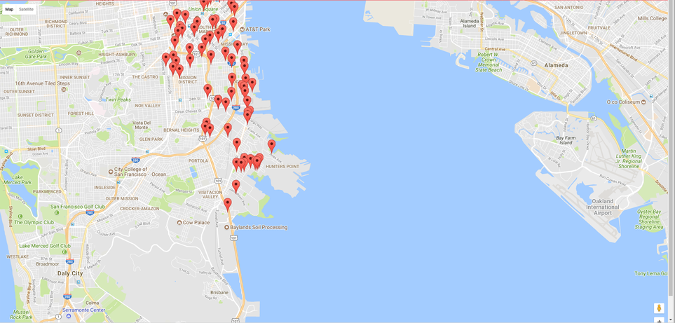

# Hackathon: Choose Your Own Express Application

The goal of this exercise is to give you a small and relatively simple Express application to build on your own. It's my hope that building this will force you to review concepts and technologies that you don't yet feel comfortable with. This exercise will require you to engage with the material that you've learned this unit.

**GOAL**: I have provided you with *two* application ideas. Pick one of these ideas and build it out according to specification.

## Choices

### Choice 1: Google Maps API + Consume Data SF API

This application tests your knowledge of: 

1. Consuming APIs 
2. AJAX using fetch 
3. Client-side rendering

**Description**: Use the Google Maps API and the [City of San Francisco API](https://datasf.org/opendata/) to create a map that displays the name of food trucks in San Francisco, CA. All of this can be written inside of a HTML file and a linked JavaScript file.

#### SF Data API 

This application uses the [DataSF Food Truck API](https://data.sfgov.org/Economy-and-Community/Mobile-Food-Facility-Permit/rqzj-sfat). The API endpoint we are hitting is:

```
https://data.sfgov.org/resource/6a9r-agq8.json
```

Documentation for this API can be found [here](https://dev.socrata.com/foundry/data.sfgov.org/6a9r-agq8).

**Use Postman/Chrome/curl to make a GET request to this API to better understand what data it returns.**

The array that is returned as a result of this API call consists of objects. Each object contains data about a food truck in SF. There are two properties we care about for each food truck object: 

* `location` - Food trucks location (lat/long coordinates)
* `applicant` - The name of the food truck/owner of food truck

Use the `fetch` API to grab food truck data and pass it along the the Google Maps API to add markers.

#### Google Maps API

To use the Google Maps API you must first create an application key. You can do this [here](https://developers.google.com/maps/documentation/javascript/get-api-key). Your key is then put in the `<script>` tag that links to the Google Maps API:

```js
<script src="https://maps.googleapis.com/maps/api/js?key=<your-key>&callback=initMap" async defer></script>
```

Using  Google Maps requires an `initMap` function that is called by the `<script>` above. You can adjust where the map centers and its initial zoom level:

```js
function initMap() {
        map = new google.maps.Map(document.getElementById('map'), {
          center: {lat: 37.753717, lng: -122.388359},
          zoom: 14
        });
      };
```

You then want to fetch the data from the API. For each data point you want to add a marker on the map and pass in the latitude and longitude of the marker:


```js
marker = new google.maps.Marker({
    position: new google.maps.LatLng(latitude, longitude),
    map: map
});
```

Please consult the Google Maps documentation [here](https://developers.google.com/maps/documentation/javascript/adding-a-google-map).

The finished application should look something like this: 



---

### Choice 2: Web Scraper + Expose an API 

#### Introduction 

>Web Scraping is a technique employed to extract large amounts of data from websites whereby the data is extracted and saved to a local file in your computer or a database

Here's the rub: You are hired by a start-up that wants to *disrupt* the book selling market. This start-up will purchase books from [this](http://books.toscrape.com/index.html) site and sell them at a 33% discount.

This application tests your knowledge of: 

1. Mongoose/MongoDB
2. Using the `request` module 
3. Parsing HTML
4. Exposing an API

#### Challenge Details 

Build a web scrapper to grab the data from [this](http://books.toscrape.com/catalogue/category/books/fantasy_19/index.html) web page. Scrape the site of all fantasy books and store the data from the books in a MongoDB database.

You should expose 2 API endpoints: 

```
api/books/fantasy // GET all fantasy books
api/books/fantasy/:id // GET a single fantasy book by id
```

The JSON that is returned by your API should have the following properties: 

* _id
* title 
* rating 
* price (in US dollars)

Using the request module make a `GET` request to the following URL: http://books.toscrape.com/catalogue/category/books/fantasy_19/index.html. 

```js
request('http://www.jtamsut.com/dummy-text/http://books.toscrape.com/catalogue/category/books/fantasy_19/index.html', function (error, response, html) {
  if (!error && response.statusCode == 200) {
    console.log(html);
  }
});
```

Use jQuery to parse the HTML. The `:first-child` psuedoclass and its derivatives will be helpful for this task. [Here](https://developer.mozilla.org/en-US/docs/Web/CSS/:first-child) is some documentation for `:first-child`.