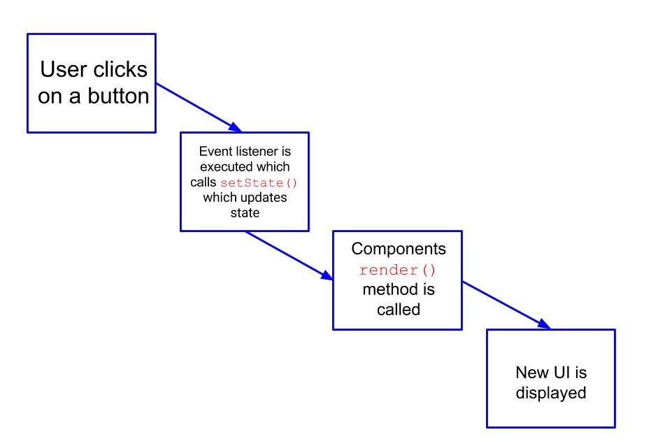

# Props and State in React

This lecture is going to explore `props` and `state` in React. So far we've seen quite a bit of React. Today we've seen:

* JSX - an XML-like syntax for generating HTML
* Components - a fundamental building block of React

## Learning Objectives

By the end of this lecture you should be comfortable *doing* the following:

* Describe the difference between props and state
* Render props passed to a component
* Render a component's state
* Use `setState()` to update a components state

## Warm-Up 

`map` is a really useful method that allows you to iterate over an array, perform some operation on each element and return a new array with the result of performing an operation on each element.

Here's an example: 

```js
const nums = [1,2,3,4,5,6,7,8]

const numsPlusOne = nums.map(num => num + 1)
```

Implement a function called map that takes two parameters: an array and a callback and maps over each element. 

```js 
// map(array, cb) -> array

// Example map invocation 
const nums = [1,2,3,4,5,6,7,8]
const addOne = num => num + 1 
console.log(map(nums, addOne)) //=> [2,3,4,5,6,7,8,9]
```

## Props and State: A First Look

We know that `props` and `state` are how we represent data in React. What is data you ask? Data could be:

* a list of posts for a given user
* a single task on a To Do list
* the contents of an e-mail

In the context of React data is *anything* we want to display to the user.

We know `props` are immutable. We simply pass `props`
from parent to child component. The child component then typically renders this data. **A component does not alter its props object**.

 Consider the example below: [](https://codesandbox.io/s/1o90rp0xk3)


```js
import React, { Component } from 'react';
import { render } from 'react-dom';

class ParentComponent extends Component {

  constructor() {
    super();
    this.state = { foo: "bar" }
  }

  render() {
    return (
      <ChildComponent foo={this.state.foo} />
    )
  }
};

const ChildComponent = ({ foo }) => {
  return (
    <div>{foo}</div>
  )
}

render(<ParentComponent />, document.getElementById('root'));
```

> Definition: An attribute on a component is any key-value pair separated by a "=" written on a component invocation.

There are a few things to note in the above example:

* We are **initializing** state in our class `constructor()` method
* `props` are passed to child components as attributes of a component. In our example, our child component is the `<ChildComponent />` component which has an attribute that has a key of `foo` and a value of `{this.state.foo}`
* `<ChildComponent />` is **NOT** altering the `props` object passed to it; it simply extracts the data from the props object and renders it
* If we were to log out `props` in `<ChildComponent />` what would be logged out would be this:

```js
Object {
	foo: "bar"
}
```


**Quiz**: What type of component is `<ParentComponent />`? What type of component is `<ChildComponent />`?

##### You Do (15 minutes)

**TASK**: Add to our initial state declaration in `<ParentComponent />`. Create a property on `this.state` called `friends` with a value of `["Nick", "Annie", "Marc"]`. Then pass this array as a prop named `friends` to `<ChildComponent />`. Lastly use `map` to create a list of `<div>`'s for each friend (e.g., `[<div>Nick</div>, <div>Annie</div>, <div>Marc</div>]`) and render each element in this array to the DOM.

## Initializing State is Very Very Very Very Different Than Updating State

**Quiz**: Where do we initialize state in a React class component?

**Only the component that initialized the state can change the state**.

**Question**: What if something happens on a child component that makes us want to alter state. *In other words how does a child component alter an ancestor's state*?
<br>
**Answer**: The parent component must pass a callback function to the child component.

Let's take a look at an example: [](https://codesandbox.io/s/6l6j7ojwk3)

Things to note about the above code snippet that was linked to:

* The `updateCounter` method is altering the state of the component it is written in!
* We are passing `updateCounter` as a `prop` to `<Clock />`

##### You Do (10 minutes)

Implement decrement functionality to our counter. This include a "Decrement" button and a new method on `<ParentComponent />` to update state.

## setState Calls A Components render() Method

Whenever `setState()` is called two things happen:

1. First, state is updated<sup>*</sup>
2. Next, the component in which the aforementioned state was defined has its `render()` method called

<sup>*</sup>This is actually an asynchronous process. We actually enqueue a state change and let React worry about when this change will happen. 



A component cannot alter its `props` object. The only way for `props` to change is for `setState` to be called, which in turn calls the component's (the component that owns the state that is) `render` method.

Remember that the `render()` method is required in all class components. When called it should examine `this.props` and `this.state` and return a single React element.

### Fundamental Theorem of State

Thou shalt not alter `state` directly,

```js
// WRONG
this.state.comment = "Hello";
```

```js
// OH SO RIGHT
this.setState({comment: "Hello"});
```

This is because `setState()` is a *special* function that does Virtual DOM "magic".

**The only place where you can assign `this.state` is the constructor**

### Asynchronous State Updates

Here is the parameter list for `setState()`: 

```
setState(updater OR stateChange, [callback])
```

The parameters `setState` accepts are: 

* The first parameter can either be an updater function OR a stateChange object 
* The second argument is a callback that will be executed once the state has been updated 


#### updater Function 

The `updater` function has the following signature: 

```
setState(prevState, props) -> stateChange
```

This updater function reconciles `props` with `prevState` and generates the new state.

#### stateChange

With the `stateChange` object we merge or update new state into old state. 


From the React docs: 

<center>
<em>
setState() enqueues changes to the component state and tells React that this component and its children need to be re-rendered with the updated state. This is the primary method you use to update the user interface in response to event handlers and server responses.
</em>


<em>
Think of setState() as a request rather than an immediate command to update the component. For better perceived performance, React may delay it, and then update several components in a single pass. React does not guarantee that the state changes are applied immediately.
</em>
</center>

<br>

Two ways to update state: 

```js
this.setState({
  counter: this.state.counter + 1
});
```
```js
this.setState((prevState) => ({
  counter: prevState.counter + 1
}));
```

From React docs: 

<center>
<em>
If the next state depends on the previous state, we recommend using the updater function form.
</em>
</center>

Above we have a callback passed to `setState()` that will update the `counter` property in `state`. **Note that we are *updating a currently existing property on state not creating a new one**. In a complex application you may be updating a currently existing property in two ways simultaneously. Using a callback ensures that the second update does overwrite the first one.

## React's Uni-Directional Data Flow

From React docs:

<center>
<em>[Passing props from parent to child component] is commonly called a "top-down" or "unidirectional" data flow. Any state is always owned by some specific component, and any data or UI derived from that state can only affect components "below" them in the tree.
<br>
If you imagine a component tree as a waterfall of props, each component's state is like an additional water source that joins it at an arbitrary point but also flows down.</em>
</center>

## Where to Put State

For each piece of state in your application:

* Identify every component that renders something based on that state.
* Find a common owner component (a single component above all the components that need the state in
the hierarchy).
* Either the common owner or another component higher up in the hierarchy should own the state.
* If you can't find a component where it makes sense to own the state, create a new component simply for holding the state and add it somewhere in the hierarchy above the common owner component

From React documentation:

<center>
<em>When you want to aggregate data from multiple children or have two child components communicate with each other, move the state upwards so that it lives in the parent component. The parent can then pass the state back down to the children via props, so that the child components are always in sync with each other and with the parent.</em>
</center>

## Mini-Lab

Use `create-react-app` to create a multi-button incrementer. Your UI should look like this: 


Whenever you click "Increment" the number above each and **every** button should increment by one.

You should have two types of components: 

* `<Counter>` should be a parent component that contains state; state should look like this: 

```js 
state = {
	count: 0
}
```
* `<Incrementer />` should be a child component of `<Counter>`;
	* `<Incrementer />` should contain the button and use the `onClick` method to call a method that updates state on `<Counter />`

The component hierarchy should look like this:

```
<Counter />
	<Incrementer />
	<Incrementer />
	<Incrementer />
	<Incrementer />
```

**Note that we display the same count four different times!**

## Bonus Lab

Build an app that looks like [this](https://5y1p5j4lrk.codesandbox.io/).

