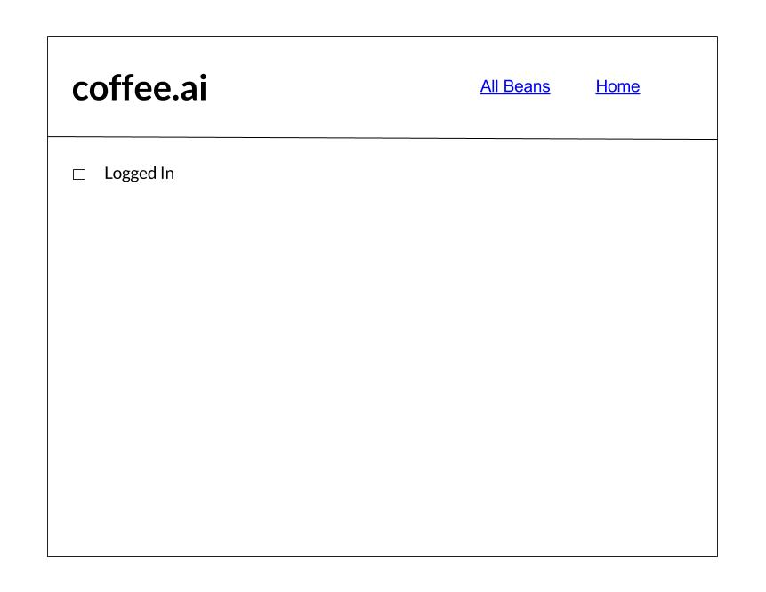
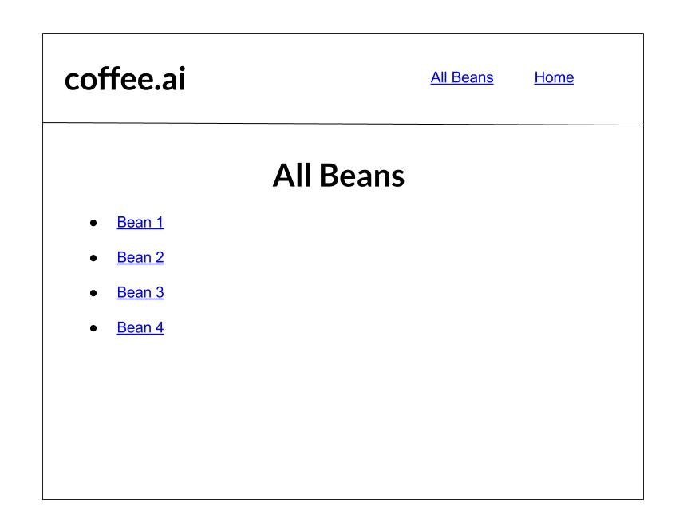
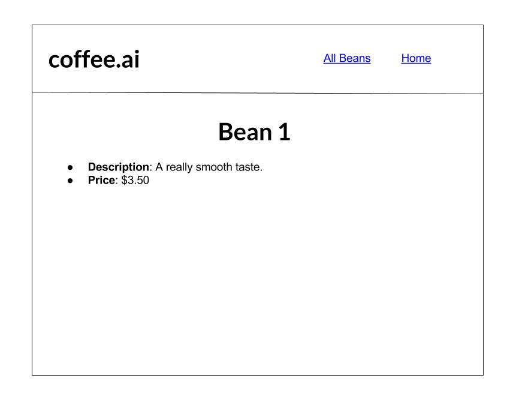

# React Router Tutorial

## Learning Objectives 

By the end of this lecture you should know:

* The difference between client-side and server-side routing 
* Know how to use the `<BrowserRouter />` and `<Route />` component to selectively render components based on URL
* Know how to use the `<Link />`

**Routing** is the process by which URL's determine what a user sees in a web browser. For example, if we consider the Rails applications we built earlier in the course, when we visit the URL `www.example.com/photos/4` we expect to see a web page with a `photo` resource that has an `id` of 4.

I want to be very clear about the difference between **server-side** and **client-side** routing:

* **Server-side routing**: Our web browser makes HTTP requests for HTML pages located on the server based on the current web page's URL
* **Client-side routing**: Our UI is updated based on the URL, but **NO** HTTP request to the server is made in the process of displaying a new view

It should be noted that URL's are an important aspect of a user's web experience because they enable:

* A user to bookmark a page
* A user to share a web page via its URL on a social media site
* A web browser's back and forward functionality

The `react-router-dom` library is a library that allows us to selectively render React components based on the current URL of a web browser.

From the React documentation:

> React Router is a collection of navigational components that compose declaratively with your application.

The term **compose** refers to the fact that we can put components inside components to compose more components. In the example below we are composing `<OuterComponent>` out of `<InnerComponent1 />` and `<InnerComponent2 />`.

```
<OuterComponent>
  <InnerComponent1 />
  <InnerComponent2 />
</OuterComponent>
```

## A Little Bit of History on the Browser History API

The DOM window object provides access to the browser's history through the `history` object. It exposes useful methods and properties that let you move back and forth through the user's history as well as manipulate the contents of the history stack.

To move back through history using the HTML5 History API:

```js
window.history.back()
```

To move forward in history using the HTML5 History API:

```js
window.history.forward()
```

React Router is built on top of the HTML history API.

## The React Router API

*React Router is really just a library that is used to display and hide React components based on the URL of a web page.*

**With React we are given a series of navigational components that we can use to accomplish routing in our application.**

What makes React Router different than what we are used is that we are going to define our Routes inside of components that React Router provides for us. React Router utilizes the idea of **dynamic routing**. With dynamic routing your route *as* your view is rendered.

All components that will either be hid or displayed using React Router should be inside a `<BrowserRouter />` component. This `<BrowserRouter />` component keeps track of the URL and previous URLs of a user's current session in a `history` object. 

**Quiz**: What piece of browser functionality is React Router able to emulate because it keeps track of a web browser's previous URLs?

**Answer**: The browser history API.

`<BrowserRouter />` components only expect a single child component, therefore it is common practice to wrap your application in a container component before passing it to your `<BrowserRouter />` component.

For example if `<AppContainer />` was our root component we would render it to the DOM like this:

```js
ReactDOM.render((
    <BrowserRouter>
        <AppContainer />   
    </BrowserRouter>
), document.getElementById('root'))
```

When building an application using React Router it is useful to create components that will be used to render content that will always be present on the page (e.g., Nav Bar, Side Menu) and different components that will be used to render page specific content (e.g., About Me page, specific user data).

## Route Component

The `<Route />` component is the fundamental component in React Router. Anytime you want to selectively render a component based on a URL you should use a `<Route />` component. 

From the React Router docs: 

> The Route component is perhaps the most important component in React Router to understand and learn to use well. Its most basic responsibility is to render some UI when a *location* matches the route’s path. A `<Route />` component expects a `path` prop that describes a possible pathname or route for your application. When we say a route "matches" we mean that the current URL path and the value of the `path` prop are matched up. When a route's path matches, a `match` object with the following properties will be created and will be passed to the component it renders as props.

* `url` - the matches part of a URL's pathname
* `path` - routes `path`
* `isExact` - `true` or `false` based on if `path === pathname` (i.e., the path on a web browser's URL) are the *exact* same
* `params` - an object containing values from the pathname

Let's play around with [Route Tester](https://pshrmn.github.io/route-tester/#) to see what a valid path looks like and to explore the match object.

Don't use `<a>` tags with React Router. By default an `<a>` tag submits a `GET` request that will cause the whole page to reload. Use React Router's `<Link />` component to enable linking between pages.

### Ways to Render With a Route 

Two popular ways to render a component using the route component are to use the `render` or `component` props.

* `<Route path="/somePath" component={componentName}>` will render a component when the path matches 

```js
<Route path="/user/:username" component={User}/>

const User = ({ match }) => {
  return <h1>Hello {match.params.username}!</h1>
}
```

Important from the React documentation:

> When you use component (instead of render or children, below) the router uses React.createElement to create a new React element from the given component. That means if you provide an inline function to the component attribute, you would create a new component every render. This results in the existing component unmounting and the new component mounting instead of just updating the existing component.

**What implications does the above piece of information have?**

* `<Route render>` allows you to render a component inline

```js
<Route path="/home" render={() => <div>Home</div>}/>
```

## Let's Route

We will be building a simple application that displays some information a sports team. Let me show you the finished product.

This application uses four React Router methods:

* `<BrowserRouters />` - a `<Router>` object that uses the hash (`#`) portion of your URL to keep your app in sync
* `<Link />` - creates an anchor tag
* `<Switch />` - renders the first child that matches the location
* `<Route />` - renders UI when a `pathname` matches the routes `path`

### Step 1: Initialize Project 

Let's create our project and install the `react-router-dom` library. We will write all of our components in `src/index.js`:

```bash
$ create-react-app sports
$ cd sports 
$ cd src
$ rm *; touch index.js
$ npm i react-router-dom
```

### Step 2: Import React, ReactDOM and BrowserRouter 

Our application is going to have two main routing components: 

1. `<Header />`
2. `<Main />`

The `<Header />` component will act as our navigational bar and the `<Main />` component will serve as the body of our application: 

```js
import React from 'react';
import ReactDOM from 'react-dom';
import {
  BrowserRouter,
  Link,
  Switch,
  Route
} from 'react-router-dom';

const App = () => (
  <div>
    <Header />
    <Main />
  </div>
)

// We need to wrap all our routing components in <BrowserRouter /> 
ReactDOM.render((
  <BrowserRouter>
    <App />
  </BrowserRouter>
), document.getElementById('root'))
```

### Step 3: Main and Header Component

Now let's write our `<Main />` and `<Header />` components. 

```js
// The Main component renders one of the three provided
// Routes (provided that one matches). Both the /roster
// and /schedule routes will match any pathname that starts
// with /roster or /schedule. The / route will only match
// when the pathname is exactly the string "/"
const Main = () => (
  <main>
    <Switch>
      <Route exact path='/' component={Home}/>
      <Route path='/roster' component={Roster}/>
      <Route path='/schedule' component={Schedule}/>
    </Switch>
  </main>
)

// The Header creates links that can be used to navigate
// between routes.
const Header = () => (
  <header>
    <nav>
      <ul>
        <li><Link to='/'>Home</Link></li>
        <li><Link to='/roster'>Roster</Link></li>
        <li><Link to='/schedule'>Schedule</Link></li>
      </ul>
    </nav>
  </header>
)
```

The `<Link />` component creates an `<a>` tag for us that will match a path in our router.


### Step 4: Simulate API

Typically our React applications retrieve data via AJAX. Let's simulate this by creating an object that acts *API-esque*.

```js
// A simple data API that will be used to get the data for our
// components. On a real website, a more robust data fetching
// solution would be more appropriate.
const PlayerAPI = {
  players: [
    { number: 1, name: "Ben Blocker", position: "G" },
    { number: 2, name: "Dave Defender", position: "D" },
    { number: 3, name: "Sam Sweeper", position: "D" },
    { number: 4, name: "Matt Midfielder", position: "M" },
    { number: 5, name: "William Winger", position: "M" },
    { number: 6, name: "Fillipe Forward", position: "F" }
  ],
  all: function() { return this.players},
  get: function(id) {
    const isPlayer = p => p.number === id
    return this.players.find(isPlayer)
  }
}
```

### Step 5: Make Schedule View/Component 

Let's create the `<Schedule />` component.

```js
const Schedule = () => (
  <div>
    <ul>
      <li>6/5 @ Evergreens</li>
      <li>6/8 vs Kickers</li>
      <li>6/14 @ United</li>
    </ul>
  </div>
)
```

### Step 6: Creating our Roster and Player Views 

Let's now create our `<Player />` and `<Roster />` components.

```js
// The FullRoster iterates over all of the players and creates
// a link to their profile page.
const FullRoster = () => (
  <div>
    <ul>
      {
        PlayerAPI.all().map(p => (
          <li key={p.number}>
            <Link to={`/roster/${p.number}`}>{p.name}</Link>
          </li>
        ))
      }
    </ul>
  </div>
)

// The Player looks up the player using the number parsed from
// the URL's pathname. If no player is found with the given
// number, then a "player not found" message is displayed.
const Player = (props) => {
  const player = PlayerAPI.get(
    parseInt(props.match.params.number, 10)
  )
  if (!player) {
    return <div>Sorry, but the player was not found</div>
  }
  return (
    <div>
      <h1>{player.name} (#{player.number})</h1>
      <h2>Position: {player.position}</h2>
      <Link to='/roster'>Back</Link>
    </div>
  )
}

// The Roster component matches one of two different routes
// depending on the full pathname
const Roster = () => (
  <Switch>
    <Route exact path='/roster' component={FullRoster}/>
    <Route path='/roster/:number' component={Player}/>
  </Switch>
)
```

## Lab: A Bunch of Beans

We've now seen a basic usage of React Router. It's now your turn to build a simple application using client-side routing.
This will be a simple application with three views. The designs for each view are below.

Things to note about this application:

* The navigational bar should not be re-rendered.
* On the Home view there should be a check box. If this box is *NOT* checked when you try to view a specific bean you should be redirected back to the Home view. If this box is checked you should be able to see data for a specific bean. To create this functionality you should use the `<Redirect />` [component](https://reacttraining.com/react-router/web/api/Redirect) that comes with `react-router-dom`.
* Just like in the Sports app you should create a separate file that will act as your Bean API. Seed this JS object with some bean data and use this data to render views.

Here are the designs:







## Lab Plus Plus: Ragnar

Build an application (I randomly called it Ragnar) using React Router. Your application should have three views.  Allow me to demo this for you. 

### Home 

The path for the home page is `/`. It should look like this: 


### Graph View

The path for the graph page is `/data/graph`. It should look like this:

 

### Table View

The path for the table page is `/data/table`. It should look like this:

 


### Materialize and React Line-Chart

Use `react-materialize` which is a library of components that are styled using the Materialize CSS library. You have to install the module using npm: 

```bash 
$ npm i react-materialize
```

Then in `public/index.html` in your React application add this to your head: 

```html
<link rel="stylesheet" href="http://fonts.googleapis.com/icon?family=Material+Icons">
<link rel="stylesheet" href="https://cdnjs.cloudflare.com/ajax/libs/materialize/0.98.0/css/materialize.min.css">
<script src="https://code.jquery.com/jquery-2.1.1.min.js"></script>
<script src="https://cdnjs.cloudflare.com/ajax/libs/materialize/0.98.0/js/materialize.min.js"></script>
```

To create the graph use the `react-linechart` module. Here is an example usage of it:

```js
import React from 'react'
import LineChart from 'react-linechart';
import './../../../node_modules/react-linechart/dist/styles.css';

const Graph = ({data}) => {

    const plotPoints = [
        {									
            color: "steelblue", 
            points: data
        }
    ];

    return (
        <div>
            <h2>Graph View</h2>
            <LineChart width={600} height={400} data={plotPoints}/>
        </div>
    )
}


export default Graph
```
