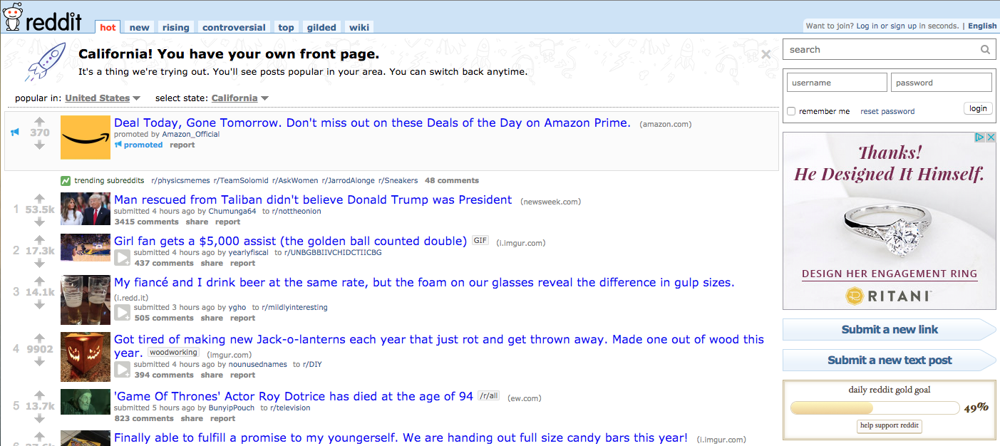

# Reddit Clone – MERN stack
Building a [Reddit](https://www.reddit.com/) clone using the popular MERN (Mongo – Express – React – Node) stack.



## PROJECT SETUP

1. Please use the starter code with can be found in the `reddit-clone-app` directory. Take a few minutes to familiarize yourself with the code
2. Configure your application starter code (`reddit-clone-app`) which can be found [here](https://github.com/ga-students/wdi-dt-57/tree/master/work/w11/d3/01-02-03-04-reddit-clone-mern/reddit-clone-app). Use [this](https://github.com/ga-students/wdi-dt-57/blob/master/work/w11/d2/full-stack-react/full-stack-react.md) guide to set up your back-end
3. Make sure MongoDB is running (`mongod`), then start your Node and React servers
    - Back-end and front-end servers should be running on separate ports, in separate Terminal tabs
4. Ensure both servers are up and running with no errors
5. Take a look around:
    - BACK-END: What routes, models, and controllers have been set up? What kind of database is it connecting to?
    - FRONT-END: What components have been set up?
        
## CREATING THE BACK-END

### Creating Post resource

1. Create a `Post` model that contains `title`, `content`, `thumbnail_image_url`, `votes`, `comments` (`comments` should be an array of embedded `Comment` schemas) in `models/Post.js` which can be found [here](https://github.com/ga-students/wdi-dt-57/blob/master/work/w11/d3/01-02-03-04-reddit-clone-mern/reddit-clone-app/models/Post.js)
2. Take a look at the API CRUD [routes](https://github.com/ga-students/wdi-dt-57/blob/master/work/w11/d3/01-02-03-04-reddit-clone-mern/reddit-clone-app/routes/api/posts.js) for the posts. Please import the `postsController` in this file.   
3. Fill out the `posts.js` controller which can be found [here](https://github.com/ga-students/wdi-dt-57/blob/master/work/w11/d3/01-02-03-04-reddit-clone-mern/reddit-clone-app/controllers/posts.js) 
4. Add to your `seed.js` file (found in `db/seeds.js`) to create a `Post` – verify that it shows up at the appropriate endpoint
5. Use POSTMAN to confirm that the other CRUD routes are working as well (PUT, DELETE)

### Creating Comment resource

1. Create a `Comment` schema that contains `content`, `votes` [here](https://github.com/ga-students/wdi-dt-57/blob/master/work/w11/d3/01-02-03-04-reddit-clone-mern/reddit-clone-app/models/Comment.js)
2. Take a look at the API CRUD routes for `Comments` [here](https://github.com/ga-students/wdi-dt-57/blob/master/work/w11/d3/01-02-03-04-reddit-clone-mern/reddit-clone-app/routes/api/comments.js)
3. Fill out the `Comments` controller using Mongoose queries
4. Add to your `seed.js` file to create a `Comment`, attached to a `Post` you've created – verify that it shows up at the appropriate endpoint
5. Use POSTMAN to confirm that the other CRUD routes are working as well (PUT, DELETE)

### Verifying Data Creation

1. Use POSTMAN to create two `Post`s 
2. Use POSTMAN to create two `Comment`s, both attached to the first `Post` you created
3. Populate the `seed.js` file to automate data seeding

## CREATING THE FRONT-END

### Setting up React
1. Go to your React app's homepage – poke around the `src/` directory to make sure you know why the UI is showing up as it is
2. Pull in react-router-dom to implement the following routes – just put in some dummy text to confirm your React routes are working, before implementing full functionality:
    - `/` routes to home page (`/pages/HomePage.js`). Displays all my posts' titles, their thumbnail images, and their votes count.
    - `/posts/:post_id` routes to each `TextPost`'s show page (`/pages/SinglePostPage.js`). Displays that post's content, attached comments, and form for adding comments (implement comments & form later)
3. Think about what will live in the state for each page – each page is basically a container
    - `<HomePage/>` will probably store all posts in its state, like we stored `this.state = { allTweets: [] }` in `<Twitter/>`, or `this.state = { allTodos: [] }` in `<TodosContainer/>`
    = `<SinglePostPage/>` will probably have all the details for a post in its state
4. Think about what components each page will contain
    - What API requests will each page make
5. Use the fetch API to "fetch" data from your Node API endpoints (e.g. `fetch`).


`fetch` documentation can be found [here](https://developer.mozilla.org/en-US/docs/Web/API/Fetch_API/Using_Fetch).
Fetch GET request:

```javascript
fetch('http://localhost:8080/api/posts').then((res) => {
  return res.json();
}).then((json) => {
  // do stuff with the JSON you get back here
  console.log(json);
});
```

Fetch POST request:

```javascript
fetch('http://localhost:8080/api/posts', {  
  method: 'POST',
  headers: {
    'Accept': 'application/json',
    'Content-Type': 'application/json',
  },
  body: JSON.stringify({
    title: 'my new post title',
    content: 'my new post content',
    thumbnail_image_url: 'some_url',
    votes: 3,
    comments: []
  })
}).then((res) => {
    return res.json()
}).then((json) => {
    // do stuff with the JSON you get back here
    console.log(json)
});
```
    
### Implementing User Stories

Here are some user stories that you should have done by the end of the day.

1. User should see all posts on the home page (**BONUS**: rank them in descending order by `votes`)
2. User should be able to click on a "Create Post" button and see a modal or navigate to a new page to create a new `Post`
3. User should be able to vote on a post
4. User should be able to create a `Comment` on a `Post`
5. User should be able to vote on a `Comment`
6. **Bonus**: User should be able to comment on a comment (requires changing the `Comment` model's schema)


## More Bonus

1. Create a `LinkPost` resource
    - Another kind of post a Reddit user can upload (simply links to an external link, e.g. news article or imgur page)
    - Model should contain fields `title`, `link_url`, `thumbnail_image_url`, `votes`,
    - Can also leave `Comment`s on a `LinkPost`
2. Create a `User` resource 
    - Model should contain fields `first_name`, `last_name`, `email`, and `password_hash`
    - Implement authentication
    - Both `Post` and `Comment` should have `author_id` (views should include author names)
3. Implement a `SubReddit` model
    - Should have `name` and `slug` (e.g. 'Software Engineering', 'software-engineering')
    - `Post` should have a `subreddit_id`
    - There should be a React route for going to subreddit routes (e.g. `/r/software-engineering`)
